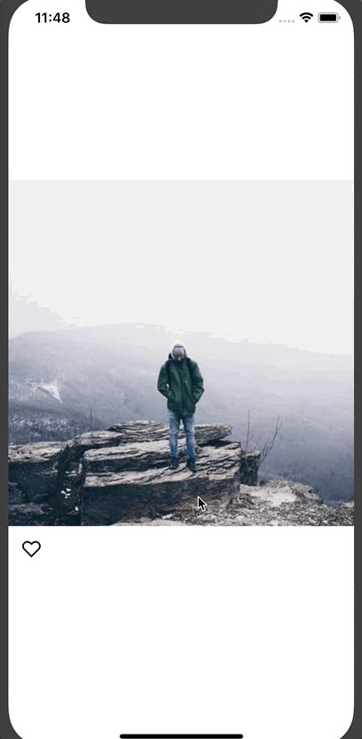

# Instagram Style Double Tap with React Native
There are a host of ways to detect a tap in React Native - but how do you detect a double tap? Detecting double taps has a host of uses - like liking a picture, causing a scroll to top in a tab, etc. Let's set up double tap detection.




We’ll start with a basic application that allows us to like a picture.

First create the app

```
create-react-native-app IGStyleDoubleTap
```

Then set up our app structure.

```
cd IGStyleDoubleTap
mkdir src
mkdir src/images
touch src/index.js
```

You’ll then want to download these [heart icons](src/images) and put them in the `src/images` directory.

Next, paste the following in `src/index.js`.

```javascript
import React from 'react';
import { StyleSheet, Text, View, Dimensions, Image, TouchableOpacity } from 'react-native';

const w = Dimensions.get('window');

export default class App extends React.Component {
  state = {
    liked: false,
  };

  toggleLike = () => this.setState(state => ({ liked: !state.liked }));

  render() {
    return (
      <View style={styles.container}>
        <Image
          source={{ uri: `https://images.pexels.com/photos/671557/pexels-photo-671557.jpeg?auto=compress&cs=tinysrgb&dpr=2&w=${w.width}` }}
          style={{ width: w.width, height: w.width }}
          resizeMode="cover"
        />
        <View style={styles.iconRow}>
          <TouchableOpacity onPress={this.toggleLike}>
            <Image
              source={this.state.liked ? require('./images/heart.png') : require('./images/heart-outline.png')}
              style={styles.heartIcon}
              resizeMode="cover"
            />
          </TouchableOpacity>
        </View>
      </View>
    );
  }
}

const styles = StyleSheet.create({
  container: {
    flex: 1,
    backgroundColor: '#fff',
    alignItems: 'center',
    justifyContent: 'center',
  },
  iconRow: {
    flexDirection: 'row',
    alignSelf: 'stretch',
    marginTop: 10,
    paddingVertical: 5,
    paddingHorizontal: 15,
  },
  heartIcon: {
    width: 20,
    height: 20,
  },
});
```

Finally, replace `App.js` with the following

```javascript
import App from './src';

export default App;
```

With that you can `yarn run ios` or `yarn run android` and you can like a picture by pressing the heart icon below the picture.

With the setup complete we can actually start the implementation.

## Detecting a Double Tap
This code is inspired by [this gist](https://gist.github.com/brunotavares/3c9a373ba5cd1b4ff28b) by Github user [brunotavares](https://github.com/brunotavares).

First, we’ll wrap our `Image` component in a  `TouchableWithoutFeedback`  component, allowing us to detect the tap(s).

On our component we’ll track the last tap in a variable named `lastTap`. We’re not using component stated here as it doesn’t affect rendering in any way. It can default to a `null` value.

```javascript
export default class App extends React.Component {
  // ...
  lastTap = null;
  // ...
}
```

Next, on our component we can set up a `handleDoubleTap` function in which we’ll compare the current tap to the last tap and, if it’s within the double tap threshold, call the appropriate function.

We’ll use `Date.now()` to compare values. `Date.now()` returns the milliseconds elapsed since January 1, 1970, 00:00:00 UTC which will work perfectly since our delay will be millisecond based.

Upon a successful double tap we’ll call the `this.toggleLike()` function otherwise we’ll update the `this.lastTap` value to be the result of `Date.now()`.

```javascript
export default class App extends React.Component {
  // ...
  lastTap = null;
  handleDoubleTap = () => {
    const now = Date.now();
    const DOUBLE_PRESS_DELAY = 300;
    if (this.lastTap && (now - this.lastTap) < DOUBLE_PRESS_DELAY) {
      this.toggleLike();
    } else {
      this.lastTap = now;
    }
  }
  // ...
}
```

We then need to wrap our `Image` component in a `TouchableWithoutFeedback` (make sure to import it from React Native!) to detect the tap(s).

```javacript
render() {
  return (
    {/* ... */}
		<TouchableWithoutFeedback onPress={this.handleDoubleTap}>
      	<Image
          	source={{ uri: `https://images.pexels.com/photos/671557/pexels-photo-671557.jpeg?auto=compress&cs=tinysrgb&dpr=2&w=${w.width}` }}
            style={{ width: w.width, height: w.width }}
            resizeMode="cover"
          />
		</TouchableWithoutFeedback>
		{/* ... */}
	);
}
```

This results in the following


## Refactoring the Double Tap Functionality to Its Own Component
What we have now works perfectly fine - but it’s not very reusable. Lets refactor it into its own component so we can reuse it easily.

First, create a new file for the component.

```
touch src/DoubleTap.js
```

And paste the following to get started

```javascript
import React from 'react';
import { TouchableWithoutFeedback } from 'react-native';

export default class DoubleTap extends React.Component {
  render() {

  }
};
```

We can then go ahead and start moving logic over from `src/index.js`. First `render`.

```javascript
import React from 'react';
import { TouchableWithoutFeedback } from 'react-native';

export default class DoubleTap extends React.Component {
  render() {
    return (
      <TouchableWithoutFeedback onPress={this.handleDoubleTap}>
        {this.props.children}
      </TouchableWithoutFeedback>
    );
  }
};
```

The only difference from before is that we’re now rendering `this.props.children` inside of the `TouchableWithoutFeedback` so we can pass any component to it.

Next up let’s set up `handleDoubleTap`.

```javascript
export default class DoubleTap extends React.Component {
  lastTap = null;
  handleDoubleTap = () => {
    const now = Date.now();
    if (this.lastTap && (now - this.lastTap) < this.props.delay) {
      this.props.onDoubleTap();
    } else {
      this.lastTap = now;
    }
  }

  // ...
};
```

You can notice two differences here. First, instead of setting a state variable for our delay we’re accessing it via `this.props.delay`. That way the consumer of the component can override it. Second, we’re calling `this.props.onDoubleTap()`  so the consumer can pass their own function down to the component.

Finally, we’ll set some default props so our component works regardless of if the consumer passes props.

```javascript
export default class DoubleTap extends React.Component {
  static defaultProps = {
    delay: 300,
    onDoubleTap: () => null,
  };

  // ...
};
```

Now let’s go ahead and use the new component. In `src/index.js`.

```javascript
import DoubleTap from './DoubleTap';

// ...

render() {
	return (
		{/* ... */}
		<DoubleTap onDoubleTap={this.handleDoubleTap}>
      	<Image
          	source={{ uri: `https://images.pexels.com/photos/671557/pexels-photo-671557.jpeg?auto=compress&cs=tinysrgb&dpr=2&w=${w.width}` }}
            style={{ width: w.width, height: w.width }}
            resizeMode="cover"
          />
		</DoubleTap>
		{/* ... */}
	);
}
```

- - - -

And there you have it! How to build an Instagram style double tap to like as well as how to refactor you code into reusable components?

The full source code is available on [Github](https://github.com/HandlebarLabs/react-native-examples-and-tutorials/blob/master/tutorials/instagram-style-double-tap/).

> Did you enjoy this tutorial? Check out other React Native tutorials [here](https://github.com/HandlebarLabs/react-native-examples-and-tutorials)!
