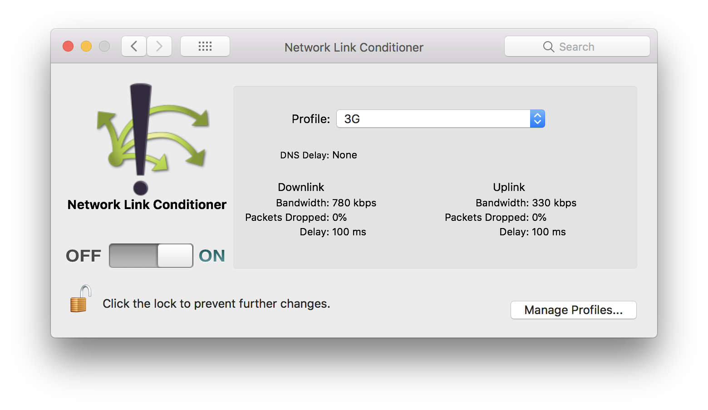
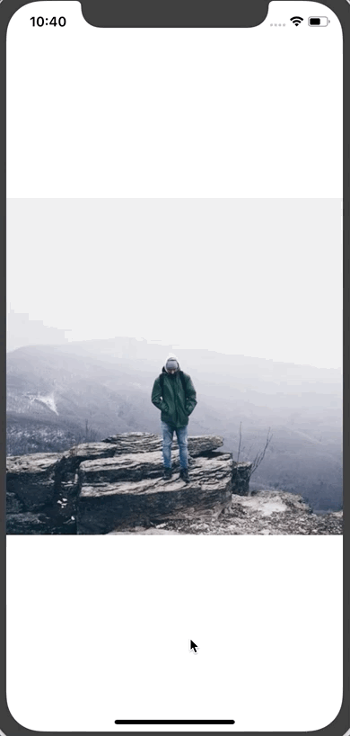
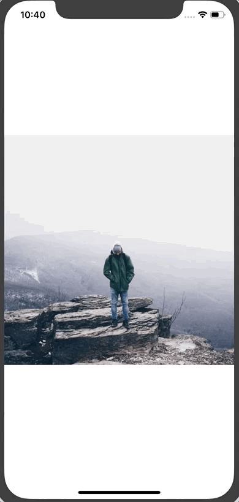
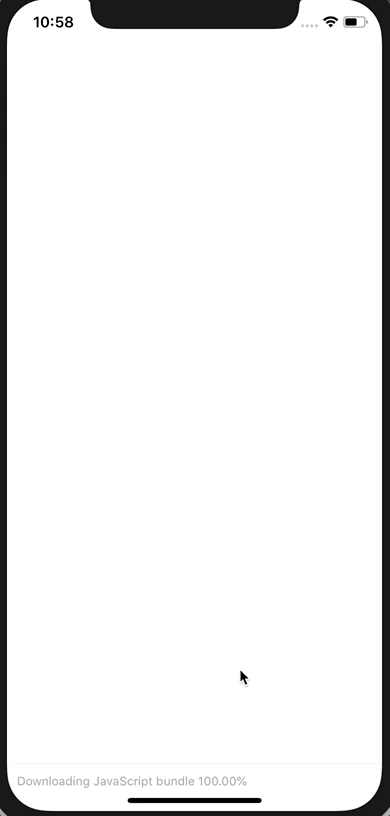
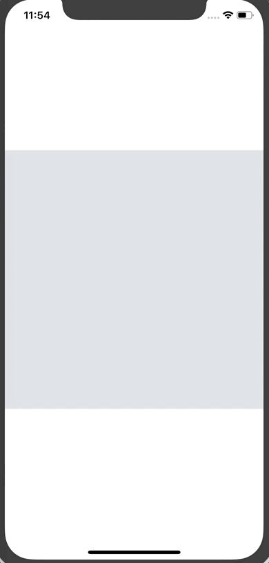
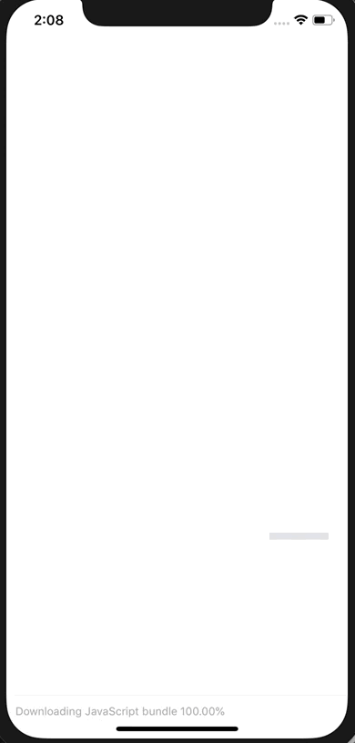

# Progressive Image Loading in React Native

Internet connection speeds are variable, especially when you're working with mobile devices. As developers we often forget that many of our users are running our apps on less powerful devices and with slower internet connections than we are. Go out into the mountains and try to access your app and see how it performs.

One of the more expensive things in an app is the remote images you're loading. They're going to take time to load, especially if they're large images.

Today we'll build a component that allows us to:

1. Pass a full size image to display (just like a normal `Image` component)
2. Pass a thumbnail image to display while we're loading the full size image
3. Automatically display a placeholder in the soon-to-be-downloaded image's place to indicate that something will be there
4. Animate between each state as we go.

## Getting Started

To start create a new React Native app (via `react-native init`, `create-react-native-app`, or the `expo` cli) and add the following to `App.js`.

```javascript
import React from 'react';
import { StyleSheet, View, Dimensions, Image } from 'react-native';

const w = Dimensions.get('window');

const styles = StyleSheet.create({
  container: {
    flex: 1,
    alignItems: 'center',
    justifyContent: 'center',
  },
});

export default class App extends React.Component {
  render() {
    return (
      <View style={styles.container}>
        <Image
          source={{ uri: `https://images.pexels.com/photos/671557/pexels-photo-671557.jpeg?w=${w.width * 2}&buster=${Math.random()}` }}
          style={{ width: w.width, height: w.width }}
          resizeMode="cover"
        />
      </View>
    );
  }
}
```

That block of code simply displays an image. It's requesting an image from [Pexels](https://www.pexels.com/) at 2x the size of the screen (we want big images so they load slowly) and the `buster` query param will help us not cache the image so we can fully see what's going on. You wouldn't want to do this in your actual app.

## Feel the Pain

Like I said before - as a developer you've probably got a pretty decent internet connection.

Let's change that.

If you're on a Mac you can install a tool called Network Link Conditioner ([here's how to install it](https://nshipster.com/network-link-conditioner/)). I'm sure there is similar for my Windows and Linux fans (chime in below if you have tool suggestions).

It will allow you to simulate just about any network condition you need. Just remember to turn it off before you start trying to stream video.

Enable it and set it to the "3G" profile.



Here's a comparison of the starter with Network Link Conditioner off vs. on.




## ProgressiveImage Component

To replace the `Image` component we'll create a new component called `ProgressiveImage`. The goal with this component is to allow it to work exactly like the normal `Image` component just with some extra features:

1. Colored background filling in where the image will be
2. Ability to pass a thumbnail image

First let's put the foundation in place:

```javascript
// ProgressiveImage.js

import React from 'react';
import { View, StyleSheet, Image } from 'react-native';

const styles = StyleSheet.create({

});

class ProgressiveImage extends React.Component {
  render() {
    return <Image {...this.props} />
  }
}

export default ProgressiveImage;
```

We're using the spread syntax to pass all of `this.props` down to the `Image` component so that everything works as expected without us having to manually define each and every prop.

Then replace `Image` in `App.js` with the new `ProgressiveImage` component.

```javascript
// App.js

import React from 'react';
import { StyleSheet, View, Dimensions } from 'react-native';
import ProgressiveImage from './ProgressiveImage';

// ...

export default class App extends React.Component {
  render() {
    return (
      <View style={styles.container}>
        <ProgressiveImage
          source={{ uri: `https://images.pexels.com/photos/671557/pexels-photo-671557.jpeg?w=${w.width * 2}&buster=${Math.random()}` }}
          style={{ width: w.width, height: w.width }}
          resizeMode="cover"
        />
      </View>
    );
  }
}
```

Everything should work exactly the same as it did before.

## Setting the Background Color

When you're loading a remote image you need to specify the width and height of the image for it to render. We'll leverage that requirement to allow us to easily set a default background color.

```javascript
import React from 'react';
import { View, StyleSheet, Image } from 'react-native';

const styles = StyleSheet.create({
  imageOverlay: {
    position: 'absolute',
    left: 0,
    right: 0,
    bottom: 0,
    top: 0,
  },
  container: {
    backgroundColor: '#e1e4e8',
  },
});

class ProgressiveImage extends React.Component {
  render() {
    return (
      <View style={styles.container}>
        <Image {...this.props} />
      </View>
    );
  }
}

export default ProgressiveImage;
```

First we create a `container` style with our background color and then wrap the `Image` component in a `View` (with the new style assigned to it).

This gives us the first phase of our progressive image loading.



## Displaying Thumnail Image

Next we'll work on displaying a thumbnail version of our image. Generating this image is beyond scope of this tutorial so we'll assume you've got the full size image and the thumbnail version.

First, to our instance of `ProgressiveImage`, we'll add a `thumbnailSource` prop which will take the exact same information as a typical `Image` source prop. In it we'll pass a smaller version  of the image (50 in this case, use whatever you want) and our cache-busting query variable (for demo purposes only).

```javascript
// App.js

// ...

export default class App extends React.Component {
  render() {
    return (
      <View style={styles.container}>
        <ProgressiveImage
          thumbnailSource={{ uri: `https://images.pexels.com/photos/671557/pexels-photo-671557.jpeg?w=50&buster=${Math.random()}` }}
          source={{ uri: `https://images.pexels.com/photos/671557/pexels-photo-671557.jpeg?w=${w.width * 2}&buster=${Math.random()}` }}
          style={{ width: w.width, height: w.width }}
          resizeMode="cover"
        />
      </View>
    );
  }
}
```

Then we'll modify our `ProgressiveImage` component. First add an `imageOverlay` style to your styles object.

```javascript
// ProgressiveImage.js

// ...

const styles = StyleSheet.create({
  imageOverlay: {
    position: 'absolute',
    left: 0,
    right: 0,
    bottom: 0,
    top: 0,
  },
  container: {
    backgroundColor: '#e1e4e8',
  },
});

// ...
```

We'll then render two `Image` components. Before we do that though we're going to use object destructuring to pull a few props off of `this.props` because we'll be overriding/combining them.

```javascript
// ProgressiveImage.js

// ...

class ProgressiveImage extends React.Component {
  render() {
    const {
      thumbnailSource,
      source,
      style,
      ...props
    } = this.props;

    return (
      <View style={styles.container}>
        <Image
          {...props}
          source={thumbnailSource}
          style={style}
        />
        <Image
          {...props}
          source={source}
          style={[styles.imageOverlay, style]}
        />
      </View>
    );
  }
}

export default ProgressiveImage;
```

You can see we pull `thumbnailSource`, `source`, and `style` off of props. We then use "rest" syntax to capture the rest of the props. This allows us to forward all general purpose props to both of our images and only forward required props to the right component (like the appropriate source).

You'll notice that we're combining the passed style and our `styles.imageOverlay` in the full size image. This is so that, via absolute positioning, the image will coverup the thumbnail version.

Here's the result:



**Note:** You'll noticed that the thumbnail image is quite pixelated. You can pass a `blurRadius` prop to the thumbnail image to blur it. I took a screenshot so you can see the difference (I'm using a blurRadius of 2 for the example).


You'll also notice that if we don't pass a `thumbnailSource` to the `ProgressiveImage` component everything works fine which means we can use this component for all of remote images even if we don't have a thumbnail image.

## Animating the Transition

The final thing we'll do is smooth out that transition between the background color, thumbnail image, and full size image. To do that we'll use the `Animated` libary from React Native.

Once you've imported `Animated` you'll then want replace the `Image` components in `ProgressiveImage` with `Animated.Image`.

You'll also want to create two new animated variables on the component, defaulting them to 0.

```javascript
// ProgressiveImage.js

import React from 'react';
import { View, StyleSheet, Animated } from 'react-native';

// ...

class ProgressiveImage extends React.Component {
  thumbnailAnimated = new Animated.Value(0);

  imageAnimated = new Animated.Value(0);

  render() {
    const {
      thumbnailSource,
      source,
      style,
      ...props
    } = this.props;

    return (
      <View style={styles.container}>
        <Animated.Image
          {...props}
          source={thumbnailSource}
          style={style}
          blurRadius={2}
        />
        <Animated.Image
          {...props}
          source={source}
          style={[styles.imageOverlay, style]}
        />
      </View>
    );
  }
}
```

These `Animated.Value`s will be used to drive the opacity of the images. When the thumbnail loads we'll set `thumbnailAnimated` to 1. When the full size image loads we'll set `imageAnimated` to 1. 

```javascript
// ProgressiveImage.js

// ...

class ProgressiveImage extends React.Component {
  thumbnailAnimated = new Animated.Value(0);

  imageAnimated = new Animated.Value(0);

  handleThumbnailLoad = () => {
    Animated.timing(this.thumbnailAnimated, {
      toValue: 1,
    }).start();
  }

  onImageLoad = () => {
    Animated.timing(this.imageAnimated, {
      toValue: 1,
    }).start();
  }

  // ...
}
```

These functions will be called via the `onLoad` prop of the `Animated.Image` components.

```javascript
// ProgressiveImage.js

// ...

class ProgressiveImage extends React.Component {
  // ...

  render() {
    const {
      thumbnailSource,
      source,
      style,
      ...props
    } = this.props;

    return (
      <View style={styles.container}>
        <Animated.Image
          {...props}
          source={thumbnailSource}
          style={[style, { opacity: this.thumbnailAnimated }]}
          onLoad={this.handleThumbnailLoad}
          blurRadius={1}
        />
        <Animated.Image
          {...props}
          source={source}
          style={[styles.imageOverlay, { opacity: this.imageAnimated }, style]}
          onLoad={this.onImageLoad}
        />
      </View>
    );
  }
}

export default ProgressiveImage;
```

That results in our final progressive image loading.



The final code can be found [on Github](https://github.com/HandlebarLabs/react-native-examples-and-tutorials/tutorials/progressive-image-loading).

---

> I hope you found this tutorial helpful! If you're looking for more React Native tutorials and examples check out [this repo](https://github.com/HandlebarLabs/react-native-examples-and-tutorials) and be sure to "clap" for this article so other devs can find and benefit from it!